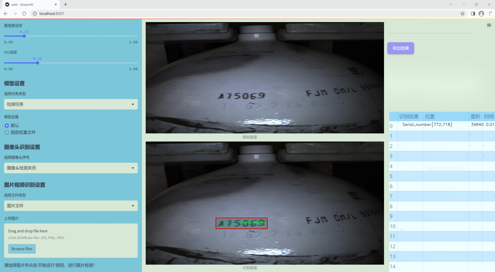
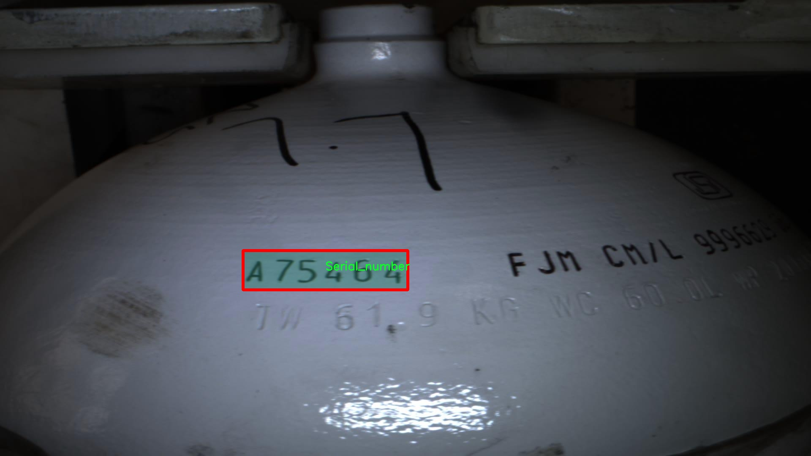

### 1.背景意义

研究背景与意义

随着工业化进程的加快，气罐的使用日益普遍，其上铭刻的信息不仅对气罐的安全使用至关重要，同时也是追溯气罐来源和管理的重要依据。气罐铭文通常包含关键信息，如CML编号、生产日期、ISI标记和序列号等，这些信息的准确识别和提取对于气罐的管理、维护及安全检查具有重要意义。然而，传统的人工识别方法效率低下且容易出错，无法满足现代工业对高效、准确数据处理的需求。因此，开发一种基于计算机视觉技术的自动化气罐铭文识别系统显得尤为重要。

在众多计算机视觉算法中，YOLO（You Only Look Once）系列因其高效的实时目标检测能力而受到广泛关注。YOLOv11作为该系列的最新版本，具备更强的特征提取能力和更快的处理速度，适合在复杂环境中进行目标识别。通过对YOLOv11的改进，可以针对气罐铭文的特定特征进行优化，从而提高识别的准确性和鲁棒性。

本研究将基于一个包含612张图像的数据集，该数据集涵盖了四类气罐铭文信息：CML编号、生产日期、ISI标记和序列号。通过对这些数据的深入分析和处理，旨在构建一个高效的气罐铭文识别系统，能够自动提取并识别铭文信息，进而为气罐的管理和追溯提供支持。此外，该系统的成功实施将为其他工业领域的铭文识别提供借鉴，推动计算机视觉技术在实际应用中的进一步发展。通过这一研究，不仅能够提升气罐管理的智能化水平，还将为实现工业自动化和智能化奠定基础，具有重要的理论和实践意义。

### 2.视频效果

[2.1 视频效果](https://www.bilibili.com/video/BV1x7UrYpEAW/)

### 3.图片效果





##### [项目涉及的源码数据来源链接](https://kdocs.cn/l/cszuIiCKVNis)**

注意：本项目提供训练的数据集和训练教程,由于版本持续更新,暂不提供权重文件（best.pt）,请按照6.训练教程进行训练后实现上图演示的效果。

### 4.数据集信息

##### 4.1 本项目数据集类别数＆类别名

nc: 4
names: ['CML_number', 'Date', 'ISI_mark', 'Serial_number']


该项目为【图像分割】数据集，请在【训练教程和Web端加载模型教程（第三步）】这一步的时候按照【图像分割】部分的教程来训练

##### 4.2 本项目数据集信息介绍

本项目数据集信息介绍

本项目旨在改进YOLOv11模型在气罐铭文识别系统中的应用，所使用的数据集以“Gas_tank_engraving”为主题，专注于气罐表面铭文的自动识别与解析。该数据集包含四个主要类别，分别为CML_number、Date、ISI_mark和Serial_number。这些类别代表了气罐铭文中常见的重要信息，能够有效支持气罐的追溯和管理。

CML_number类别主要用于识别气罐的制造商代码，通常由字母和数字组合而成，能够提供有关气罐生产背景的重要信息。Date类别则记录了气罐的生产日期或检验日期，确保气罐在使用过程中的安全性和合规性。ISI_mark类别是指印度标准局标志，表明气罐符合国家安全标准，具有重要的监管意义。最后，Serial_number类别则是气罐的唯一识别码，能够帮助追踪每个气罐的使用历史和维护记录。

该数据集的构建过程经过精心设计，确保了样本的多样性和代表性。通过收集不同制造商、不同批次和不同使用环境下的气罐铭文图像，数据集涵盖了多种字体、尺寸和表面条件的变化。这种多样性不仅增强了模型的泛化能力，也提高了在实际应用中的识别准确率。此外，数据集中的图像经过标注，确保每个类别的铭文信息清晰可辨，为YOLOv11模型的训练提供了高质量的输入。

通过对该数据集的深入分析与应用，我们期望能够显著提升气罐铭文的自动识别效率，为气罐的安全管理和监管提供有力支持。





### 5.全套项目环境部署视频教程（零基础手把手教学）

[5.1 所需软件PyCharm和Anaconda安装教程（第一步）](https://www.bilibili.com/video/BV1BoC1YCEKi/?spm_id_from=333.999.0.0&vd_source=bc9aec86d164b67a7004b996143742dc)


[5.2 安装Python虚拟环境创建和依赖库安装视频教程（第二步）](https://www.bilibili.com/video/BV1ZoC1YCEBw?spm_id_from=333.788.videopod.sections&vd_source=bc9aec86d164b67a7004b996143742dc)

### 6.改进YOLOv11训练教程和Web_UI前端加载模型教程（零基础手把手教学）

[6.1 改进YOLOv11训练教程和Web_UI前端加载模型教程（第三步）](https://www.bilibili.com/video/BV1BoC1YCEhR?spm_id_from=333.788.videopod.sections&vd_source=bc9aec86d164b67a7004b996143742dc)


按照上面的训练视频教程链接加载项目提供的数据集，运行train.py即可开始训练



     Epoch   gpu_mem       box       obj       cls    labels  img_size
     1/200     20.8G   0.01576   0.01955  0.007536        22      1280: 100%|██████████| 849/849 [14:42<00:00,  1.04s/it]
               Class     Images     Labels          P          R     mAP@.5 mAP@.5:.95: 100%|██████████| 213/213 [01:14<00:00,  2.87it/s]
                 all       3395      17314      0.994      0.957      0.0957      0.0843

     Epoch   gpu_mem       box       obj       cls    labels  img_size
     2/200     20.8G   0.01578   0.01923  0.007006        22      1280: 100%|██████████| 849/849 [14:44<00:00,  1.04s/it]
               Class     Images     Labels          P          R     mAP@.5 mAP@.5:.95: 100%|██████████| 213/213 [01:12<00:00,  2.95it/s]
                 all       3395      17314      0.996      0.956      0.0957      0.0845

     Epoch   gpu_mem       box       obj       cls    labels  img_size
     3/200     20.8G   0.01561    0.0191  0.006895        27      1280: 100%|██████████| 849/849 [10:56<00:00,  1.29it/s]
               Class     Images     Labels          P          R     mAP@.5 mAP@.5:.95: 100%|███████   | 187/213 [00:52<00:00,  4.04it/s]
                 all       3395      17314      0.996      0.957      0.0957      0.0845


###### [项目数据集下载链接](https://kdocs.cn/l/cszuIiCKVNis)

### 7.原始YOLOv11算法讲解

YOLO11采用改进的骨干和颈部架构，增强了特征提取能力，提高了物体检测的精确度和复杂任务的表现。YOLO11引入精炼的架构设计和优化的训练流程，实现更快的处理速度，同时保持精度和性能之间的最佳平衡。通过模型设计的进步，YOLO11m在COCO数据集上实现了更高的均值平均精度（mAP），同时使用比YOLOv8m少22%的参数，使其在不妥协准确性的情况下更加计算高效。YOLO11可以无缝部署在各种环境中，包括边缘设备、云平台以及支持NVIDIA
GPU的系统，确保最大灵活性。无论是物体检测、实例分割、图像分类、姿态估计，还是定向物体检测（OBB），YOLO11都旨在应对多样的计算机视觉挑战。


##### **Ultralytics YOLO11相比于之前版本的主要改进有哪些？**

Ultralytics YOLO11在其前身基础上引入了几项重要进步。主要改进包括：

  1. **增强的特征提取** ：YOLO11采用改进的骨干和颈部架构，增强了特征提取能力，提高了物体检测的精确度。
  2.  **优化的效率和速度** ：精炼的架构设计和优化的训练流程实现了更快的处理速度，同时保持了准确性和性能之间的平衡。
  3.  **更高的准确性与更少的参数** ：YOLO11m在COCO数据集上实现了更高的均值平均精度（mAP），同时使用比YOLOv8m少22%的参数，使其在不妥协准确性的情况下更加计算高效。
  4.  **环境适应性强** ：YOLO11可以在多种环境中部署，包括边缘设备、云平台以及支持NVIDIA GPU的系统。
  5.  **支持广泛的任务** ：YOLO11支持多种计算机视觉任务，如物体检测、实例分割、图像分类、姿态估计和定向物体检测（OBB）。

我们先来看一下其网络结构有什么变化，可以看出，相比较于YOLOv8模型，其将CF2模块改成C3K2，同时在SPPF模块后面添加了一个C2PSA模块，且将YOLOv10的head思想引入到YOLO11的head中，使用深度可分离的方法，减少冗余计算，提高效率。下面我们来详细看一下这两个模块的结构是怎么构成的，以及它们为什么要这样设计


##### C3K2的网络结构

从下面图中我们可以看到，C3K2模块其实就是C2F模块转变出来的，它代码中有一个设置，就是当c3k这个参数为FALSE的时候，C3K2模块就是C2F模块，也就是说它的Bottleneck是普通的Bottleneck；反之当它为true的时候，将Bottleneck模块替换成C3模块。


##### C2PSA的网络结构

` `C2PSA是对 `C2f` 模块的扩展，它结合了PSA(Pointwise Spatial
Attention)块，用于增强特征提取和注意力机制。通过在标准 `C2f` 模块中引入 PSA
块，C2PSA实现了更强大的注意力机制，从而提高了模型对重要特征的捕捉能力。


##### **C2f 模块回顾：**

**** C2f模块是一个更快的 CSP（Cross Stage Partial）瓶颈实现，它通过两个卷积层和多个 Bottleneck
块进行特征提取。相比传统的 CSPNet，C2f 优化了瓶颈层的结构，使得计算速度更快。在 C2f中，`cv1` 是第一个 1x1
卷积，用于减少通道数；`cv2` 是另一个 1x1 卷积，用于恢复输出通道数。而 `n` 是一个包含 Bottleneck 块的数量，用于提取特征。

##### **C2PSA 模块的增强** ：

**C2PSA** 扩展了 C2f，通过引入PSA( **Position-Sensitive Attention)**
，旨在通过多头注意力机制和前馈神经网络来增强特征提取能力。它可以选择性地添加残差结构（shortcut）以优化梯度传播和网络训练效果。同时，使用FFN
可以将输入特征映射到更高维的空间，捕获输入特征的复杂非线性关系，允许模型学习更丰富的特征表示。

##### head部分

YOLO11在head部分的cls分支上使用深度可分离卷积 ，具体代码如下，cv2边界框回归分支，cv3分类分支。

    
    
     self.cv2 = nn.ModuleList(
                nn.Sequential(Conv(x, c2, 3), Conv(c2, c2, 3), nn.Conv2d(c2, 4 * self.reg_max, 1)) for x in ch
            )
            self.cv3 = nn.ModuleList(
                nn.Sequential(
                    nn.Sequential(DWConv(x, x, 3), Conv(x, c3, 1)),
                    nn.Sequential(DWConv(c3, c3, 3), Conv(c3, c3, 1)),
                    nn.Conv2d(c3, self.nc, 1),
                )
                for x in ch
            )


### 8.200+种全套改进YOLOV11创新点原理讲解

#### 8.1 200+种全套改进YOLOV11创新点原理讲解大全

由于篇幅限制，每个创新点的具体原理讲解就不全部展开，具体见下列网址中的改进模块对应项目的技术原理博客网址【Blog】（创新点均为模块化搭建，原理适配YOLOv5~YOLOv11等各种版本）

[改进模块技术原理博客【Blog】网址链接](https://gitee.com/qunmasj/good)


#### 8.2 精选部分改进YOLOV11创新点原理讲解

###### 这里节选部分改进创新点展开原理讲解(完整的改进原理见上图和[改进模块技术原理博客链接](https://gitee.com/qunmasj/good)【如果此小节的图加载失败可以通过CSDN或者Github搜索该博客的标题访问原始博客，原始博客图片显示正常】


借鉴了其他算法的这些设计思想

借鉴了VGG的思想，使用了较多的3×3卷积，在每一次池化操作后，将通道数翻倍；

借鉴了network in network的思想，使用全局平均池化（global average pooling）做预测，并把1×1的卷积核置于3×3的卷积核之间，用来压缩特征；（我没找到这一步体现在哪里）

使用了批归一化层稳定模型训练，加速收敛，并且起到正则化作用。

    以上三点为Darknet19借鉴其他模型的点。Darknet53当然是在继承了Darknet19的这些优点的基础上再新增了下面这些优点的。因此列在了这里

借鉴了ResNet的思想，在网络中大量使用了残差连接，因此网络结构可以设计的很深，并且缓解了训练中梯度消失的问题，使得模型更容易收敛。

使用步长为2的卷积层代替池化层实现降采样。（这一点在经典的Darknet-53上是很明显的，output的长和宽从256降到128，再降低到64，一路降低到8，应该是通过步长为2的卷积层实现的；在YOLOv11的卷积层中也有体现，比如图中我标出的这些位置）

#### 特征融合

模型架构图如下

  Darknet-53的特点可以这样概括：（Conv卷积模块+Residual Block残差块）串行叠加4次

  Conv卷积层+Residual Block残差网络就被称为一个stage


上面红色指出的那个，原始的Darknet-53里面有一层 卷积，在YOLOv11里面，把一层卷积移除了

为什么移除呢？

        原始Darknet-53模型中间加的这个卷积层做了什么？滤波器（卷积核）的个数从 上一个卷积层的512个，先增加到1024个卷积核，然后下一层卷积的卷积核的个数又降低到512个

        移除掉这一层以后，少了1024个卷积核，就可以少做1024次卷积运算，同时也少了1024个3×3的卷积核的参数，也就是少了9×1024个参数需要拟合。这样可以大大减少了模型的参数，（相当于做了轻量化吧）

        移除掉这个卷积层，可能是因为作者发现移除掉这个卷积层以后，模型的score有所提升，所以才移除掉的。为什么移除掉以后，分数有所提高呢？可能是因为多了这些参数就容易，参数过多导致模型在训练集删过拟合，但是在测试集上表现很差，最终模型的分数比较低。你移除掉这个卷积层以后，参数减少了，过拟合现象不那么严重了，泛化能力增强了。当然这个是，拿着你做实验的结论，反过来再找补，再去强行解释这种现象的合理性。

过拟合


通过MMdetection官方绘制册这个图我们可以看到，进来的这张图片经过一个“Feature Pyramid Network(简称FPN)”，然后最后的P3、P4、P5传递给下一层的Neck和Head去做识别任务。 PAN（Path Aggregation Network）


“FPN是自顶向下，将高层的强语义特征传递下来。PAN就是在FPN的后面添加一个自底向上的金字塔，对FPN补充，将低层的强定位特征传递上去，

FPN是自顶（小尺寸，卷积次数多得到的结果，语义信息丰富）向下（大尺寸，卷积次数少得到的结果），将高层的强语义特征传递下来，对整个金字塔进行增强，不过只增强了语义信息，对定位信息没有传递。PAN就是针对这一点，在FPN的后面添加一个自底（卷积次数少，大尺寸）向上（卷积次数多，小尺寸，语义信息丰富）的金字塔，对FPN补充，将低层的强定位特征传递上去，又被称之为“双塔战术”。

FPN层自顶向下传达强语义特征，而特征金字塔则自底向上传达强定位特征，两两联手，从不同的主干层对不同的检测层进行参数聚合,这样的操作确实很皮。
#### 自底向上增强

而 PAN（Path Aggregation Network）是对 FPN 的一种改进，它的设计理念是在 FPN 后面添加一个自底向上的金字塔。PAN 引入了路径聚合的方式，通过将浅层特征图（低分辨率但语义信息较弱）和深层特征图（高分辨率但语义信息丰富）进行聚合，并沿着特定的路径传递特征信息，将低层的强定位特征传递上去。这样的操作能够进一步增强多尺度特征的表达能力，使得 PAN 在目标检测任务中表现更加优秀。


### 可重参化EfficientRepBiPAN优化Neck
#### Repvgg-style
Repvgg-style的卷积层包含
卷积+ReLU结构，该结构能够有效地利用硬件资源。

在训练时，Repvgg-style的卷积层包含
卷积、
卷积、identity。（下图左图）


在推理时，通过重参数化（re-parameterization），上述的多分支结构可以转换为单分支的
卷积。（下图右图）


基于上述思想，作者设计了对GPU硬件友好的EfficientRep Backbone和Rep-PAN Neck，将它们用于YOLOv6中。

EfficientRep Backbone的结构图：


Rep-PAN Neck结构图：


#### Multi-path
只使用repvgg-style不能达到很好的精度-速度平衡，对于大模型，作者探索了多路径的网络结构。

参考该博客提出了Bep unit，其结构如下图所示：


CSP（Cross Stage Partial）-style计算量小，且有丰富的梯度融合信息，广泛应用于YOLO系列中，比如YOLOv11、PPYOLOE。

作者将Bep unit与CSP-style结合，设计了一种新的网络结构BepC3，如下图所示：


基于BepC3模块，作者设计了新的CSPBep Backbone和CSPRepPAN Neck，以达到很好的精度-速度平衡。

其他YOLO系列在使用CSP-stype结构时，partial ratio设置为1/2。为了达到更好的性能，在YOLOv6m中partial ratio的值为2/3，在YOLOv6l中partial ratio的值为1/2。

对于YOLOv6m，单纯使用Rep-style结构和使用BepC3结构的对比如下图所示：

#### BIFPN
BiFPN 全称 Bidirectional Feature Pyramid Network 加权双向（自顶向下 + 自低向上）特征金字塔网络。

相比较于PANet，BiFPN在设计上的改变：

总结下图：
图d 蓝色部分为自顶向下的通路，传递的是高层特征的语义信息；红色部分是自底向上的通路，传递的是低层特征的位置信息；紫色部分是上述第二点提到的同一层在输入节点和输入节点间新加的一条边。


我们删除那些只有一条输入边的节点。这么做的思路很简单：如果一个节点只有一条输入边而没有特征融合，那么它对旨在融合不同特征的特征网络的贡献就会很小。删除它对我们的网络影响不大，同时简化了双向网络；如上图d 的 P7右边第一个节点

如果原始输入节点和输出节点处于同一层，我们会在原始输入节点和输出节点之间添加一条额外的边。思路：以在不增加太多成本的情况下融合更多的特性；

与只有一个自顶向下和一个自底向上路径的PANet不同，我们处理每个双向路径(自顶向下和自底而上)路径作为一个特征网络层，并重复同一层多次，以实现更高层次的特征融合。如下图EfficientNet 的网络结构所示，我们对BiFPN是重复使用多次的。而这个使用次数也不是我们认为设定的，而是作为参数一起加入网络的设计当中，使用NAS技术算出来的。


Weighted Feature Fusion 带权特征融合：学习不同输入特征的重要性，对不同输入特征有区分的融合。
设计思路：传统的特征融合往往只是简单的 feature map 叠加/相加 (sum them up)，比如使用concat或者shortcut连接，而不对同时加进来的 feature map 进行区分。然而，不同的输入 feature map 具有不同的分辨率，它们对融合输入 feature map 的贡献也是不同的，因此简单的对他们进行相加或叠加处理并不是最佳的操作。所以这里我们提出了一种简单而高效的加权特融合的机制。
常见的带权特征融合有三种方法，分别是：


​
  这种方法比较简单，直接加一个可学习的权重。但是由于这个权重不受限制，所有可能引起训练的不稳定，所有并不推荐。
Softmax-based fusion: O = ∑ i e w i ∗ I i ϵ + ∑ j e w j O = \sum_{i} \frac{e^{w_i} * I_i}{ \epsilon+\sum_{j}e^{w_j}}O=∑ 

 

​
  使用这种方法可以将范围放缩到 [ 0 , 1 ] [0, 1][0,1] 之间，训练稳定，但是训练很慢，所有也不推荐。
Fast normalized fusion: O = ∑ i w i ∗ I i ϵ + ∑ j w j O = \sum_{i} \frac{w_i * I_i}{ \epsilon+\sum_{j}w_j}O=∑ 


### 9.系统功能展示

图9.1.系统支持检测结果表格显示

  图9.2.系统支持置信度和IOU阈值手动调节

  图9.3.系统支持自定义加载权重文件best.pt(需要你通过步骤5中训练获得)

  图9.4.系统支持摄像头实时识别

  图9.5.系统支持图片识别

  图9.6.系统支持视频识别

  图9.7.系统支持识别结果文件自动保存

  图9.8.系统支持Excel导出检测结果数据


### 10. YOLOv11核心改进源码讲解

#### 10.1 repvit.py

以下是对给定代码的核心部分进行分析和详细注释的结果。我们将保留主要的类和函数，并添加中文注释以解释其功能和作用。

```python
import torch.nn as nn
import numpy as np
from timm.models.layers import SqueezeExcite
import torch

# 定义可导出的模型名称
__all__ = ['repvit_m0_9', 'repvit_m1_0', 'repvit_m1_1', 'repvit_m1_5', 'repvit_m2_3']

def replace_batchnorm(net):
    """
    替换网络中的 BatchNorm2d 层为 Identity 层，以便在推理时加速计算。
    :param net: 需要替换 BatchNorm 的网络模型
    """
    for child_name, child in net.named_children():
        if hasattr(child, 'fuse_self'):
            # 如果子模块支持融合，进行融合
            fused = child.fuse_self()
            setattr(net, child_name, fused)
            replace_batchnorm(fused)
        elif isinstance(child, torch.nn.BatchNorm2d):
            # 将 BatchNorm 替换为 Identity
            setattr(net, child_name, torch.nn.Identity())
        else:
            replace_batchnorm(child)

def _make_divisible(v, divisor, min_value=None):
    """
    确保所有层的通道数是 divisor 的倍数。
    :param v: 原始通道数
    :param divisor: 需要被整除的数
    :param min_value: 最小值
    :return: 处理后的通道数
    """
    if min_value is None:
        min_value = divisor
    new_v = max(min_value, int(v + divisor / 2) // divisor * divisor)
    # 确保下调不会超过 10%
    if new_v < 0.9 * v:
        new_v += divisor
    return new_v

class Conv2d_BN(torch.nn.Sequential):
    """
    自定义的卷积层，包含卷积和 BatchNorm 层。
    """
    def __init__(self, a, b, ks=1, stride=1, pad=0, dilation=1,
                 groups=1, bn_weight_init=1):
        super().__init__()
        # 添加卷积层
        self.add_module('c', torch.nn.Conv2d(
            a, b, ks, stride, pad, dilation, groups, bias=False))
        # 添加 BatchNorm 层
        self.add_module('bn', torch.nn.BatchNorm2d(b))
        # 初始化 BatchNorm 权重
        torch.nn.init.constant_(self.bn.weight, bn_weight_init)
        torch.nn.init.constant_(self.bn.bias, 0)

    @torch.no_grad()
    def fuse_self(self):
        """
        融合卷积层和 BatchNorm 层为一个卷积层。
        :return: 融合后的卷积层
        """
        c, bn = self._modules.values()
        w = bn.weight / (bn.running_var + bn.eps)**0.5
        w = c.weight * w[:, None, None, None]
        b = bn.bias - bn.running_mean * bn.weight / \
            (bn.running_var + bn.eps)**0.5
        m = torch.nn.Conv2d(w.size(1) * self.c.groups, w.size(
            0), w.shape[2:], stride=self.c.stride, padding=self.c.padding, dilation=self.c.dilation, groups=self.c.groups,
            device=c.weight.device)
        m.weight.data.copy_(w)
        m.bias.data.copy_(b)
        return m

class Residual(torch.nn.Module):
    """
    残差块，包含输入与经过卷积处理的输出相加。
    """
    def __init__(self, m, drop=0.):
        super().__init__()
        self.m = m  # 卷积模块
        self.drop = drop  # dropout 概率

    def forward(self, x):
        if self.training and self.drop > 0:
            # 在训练时应用 dropout
            return x + self.m(x) * torch.rand(x.size(0), 1, 1, 1,
                                              device=x.device).ge_(self.drop).div(1 - self.drop).detach()
        else:
            return x + self.m(x)
    
    @torch.no_grad()
    def fuse_self(self):
        """
        融合残差块中的卷积层。
        :return: 融合后的卷积层
        """
        if isinstance(self.m, Conv2d_BN):
            m = self.m.fuse_self()
            identity = torch.ones(m.weight.shape[0], m.weight.shape[1], 1, 1)
            identity = torch.nn.functional.pad(identity, [1,1,1,1])
            m.weight += identity.to(m.weight.device)
            return m
        else:
            return self

class RepViTBlock(nn.Module):
    """
    RepViT 块，包含 token mixer 和 channel mixer。
    """
    def __init__(self, inp, hidden_dim, oup, kernel_size, stride, use_se, use_hs):
        super(RepViTBlock, self).__init__()
        assert stride in [1, 2]
        self.identity = stride == 1 and inp == oup
        assert(hidden_dim == 2 * inp)

        if stride == 2:
            # stride 为 2 时的结构
            self.token_mixer = nn.Sequential(
                Conv2d_BN(inp, inp, kernel_size, stride, (kernel_size - 1) // 2, groups=inp),
                SqueezeExcite(inp, 0.25) if use_se else nn.Identity(),
                Conv2d_BN(inp, oup, ks=1, stride=1, pad=0)
            )
            self.channel_mixer = Residual(nn.Sequential(
                    Conv2d_BN(oup, 2 * oup, 1, 1, 0),
                    nn.GELU() if use_hs else nn.GELU(),
                    Conv2d_BN(2 * oup, oup, 1, 1, 0, bn_weight_init=0),
                ))
        else:
            # stride 为 1 时的结构
            assert(self.identity)
            self.token_mixer = nn.Sequential(
                RepVGGDW(inp),
                SqueezeExcite(inp, 0.25) if use_se else nn.Identity(),
            )
            self.channel_mixer = Residual(nn.Sequential(
                    Conv2d_BN(inp, hidden_dim, 1, 1, 0),
                    nn.GELU() if use_hs else nn.GELU(),
                    Conv2d_BN(hidden_dim, oup, 1, 1, 0, bn_weight_init=0),
                ))

    def forward(self, x):
        return self.channel_mixer(self.token_mixer(x))

class RepViT(nn.Module):
    """
    RepViT 模型，包含多个 RepViTBlock。
    """
    def __init__(self, cfgs):
        super(RepViT, self).__init__()
        self.cfgs = cfgs  # 配置参数

        # 构建第一层
        input_channel = self.cfgs[0][2]
        patch_embed = torch.nn.Sequential(Conv2d_BN(3, input_channel // 2, 3, 2, 1), torch.nn.GELU(),
                           Conv2d_BN(input_channel // 2, input_channel, 3, 2, 1))
        layers = [patch_embed]
        # 构建 RepViTBlock
        block = RepViTBlock
        for k, t, c, use_se, use_hs, s in self.cfgs:
            output_channel = _make_divisible(c, 8)
            exp_size = _make_divisible(input_channel * t, 8)
            layers.append(block(input_channel, exp_size, output_channel, k, s, use_se, use_hs))
            input_channel = output_channel
        self.features = nn.ModuleList(layers)

    def forward(self, x):
        features = []
        for f in self.features:
            x = f(x)
            features.append(x)
        return features
    
    def switch_to_deploy(self):
        """
        切换到推理模式，替换 BatchNorm。
        """
        replace_batchnorm(self)

def repvit_m2_3(weights=''):
    """
    构建 RepViT 模型的特定版本。
    :param weights: 预训练权重路径
    :return: RepViT 模型
    """
    cfgs = [
        # k, t, c, SE, HS, s 
        [3,   2,  80, 1, 0, 1],
        [3,   2,  80, 0, 0, 1],
        # ... 省略其他配置
        [3,   2, 640, 0, 1, 1],
    ]
    model = RepViT(cfgs)
    if weights:
        model.load_state_dict(torch.load(weights)['model'])
    return model

if __name__ == '__main__':
    model = repvit_m2_3('repvit_m2_3_distill_450e.pth')
    inputs = torch.randn((1, 3, 640, 640))
    res = model(inputs)
    for i in res:
        print(i.size())
```

### 主要改动和注释说明：
1. **保留了核心类和函数**：保留了 `RepViT`, `RepViTBlock`, `Conv2d_BN`, `Residual` 等核心类，以及 `replace_batchnorm` 和 `_make_divisible` 函数。
2. **详细注释**：为每个类和函数添加了详细的中文注释，解释其功能和参数含义。
3. **省略了重复的代码**：在配置列表中省略了部分重复的配置，以保持代码简洁。

以上是对代码的核心部分进行分析和注释的结果。

这个程序文件 `repvit.py` 实现了一个名为 RepViT 的深度学习模型，主要用于计算机视觉任务。它结合了卷积神经网络（CNN）和视觉变换器（ViT）的优点，采用了一种高效的结构设计。以下是对代码的逐步分析和说明。

首先，程序导入了必要的库，包括 PyTorch、NumPy 和 timm 库中的 SqueezeExcite 层。接着，定义了一个 `replace_batchnorm` 函数，用于替换模型中的 BatchNorm2d 层为 Identity 层，以便在推理时提高效率。这个函数会递归遍历模型的所有子模块，查找并替换 BatchNorm 层。

接下来，定义了一个 `_make_divisible` 函数，它的作用是确保网络中所有层的通道数都是 8 的倍数。这是为了兼容某些硬件加速器的要求。

然后，定义了一个 `Conv2d_BN` 类，继承自 `torch.nn.Sequential`，它包含一个卷积层和一个 BatchNorm 层，并在初始化时对 BatchNorm 的权重和偏置进行了初始化。该类还提供了一个 `fuse_self` 方法，用于将卷积层和 BatchNorm 层融合为一个卷积层，以减少计算量。

接着，定义了一个 `Residual` 类，表示残差连接的模块。它在前向传播中将输入与经过卷积处理的输出相加，并在训练时引入随机丢弃机制。这个类同样实现了 `fuse_self` 方法，用于融合卷积层。

`RepVGGDW` 类是一个特殊的卷积模块，包含深度可分离卷积的实现。它的前向传播将输入通过两个卷积层进行处理，并通过 BatchNorm 层进行归一化。

`RepViTBlock` 类则是 RepViT 模型的基本构建块。它根据输入的维度和配置，构建 token mixer 和 channel mixer。token mixer 负责处理空间信息，而 channel mixer 则处理通道信息。

`RepViT` 类是整个模型的核心，它根据给定的配置构建多个 `RepViTBlock`。在初始化时，模型会构建输入层和多个倒残差块，并将它们组合成一个完整的网络。模型的前向传播方法会返回不同尺度的特征图，以便后续的处理。

在模型的定义中，还提供了 `switch_to_deploy` 方法，用于在推理时替换 BatchNorm 层，以提高推理速度。

`update_weight` 函数用于更新模型的权重，确保新权重与模型结构匹配。

接下来，定义了多个函数（如 `repvit_m0_9`、`repvit_m1_0` 等），每个函数构建一个特定配置的 RepViT 模型，并可以选择加载预训练权重。

最后，在 `__main__` 块中，创建了一个 RepViT 模型实例，并对一个随机输入进行前向传播，输出各层的特征图大小。

总体而言，这个文件实现了一个高效的深度学习模型，结合了卷积和变换器的优点，适用于各种计算机视觉任务。

#### 10.2 wtconv2d.py

以下是经过简化和注释的核心代码部分：

```python
import torch
import torch.nn as nn
import torch.nn.functional as F
from torch.autograd import Function
import pywt

def create_wavelet_filter(wave, in_size, out_size, type=torch.float):
    # 创建小波滤波器
    w = pywt.Wavelet(wave)  # 使用pywt库创建小波对象
    # 反转小波的分解高通和低通滤波器
    dec_hi = torch.tensor(w.dec_hi[::-1], dtype=type)
    dec_lo = torch.tensor(w.dec_lo[::-1], dtype=type)
    # 生成分解滤波器
    dec_filters = torch.stack([dec_lo.unsqueeze(0) * dec_lo.unsqueeze(1),
                               dec_lo.unsqueeze(0) * dec_hi.unsqueeze(1),
                               dec_hi.unsqueeze(0) * dec_lo.unsqueeze(1),
                               dec_hi.unsqueeze(0) * dec_hi.unsqueeze(1)], dim=0)
    # 扩展滤波器以适应输入通道数
    dec_filters = dec_filters[:, None].repeat(in_size, 1, 1, 1)

    # 反转小波的重构高通和低通滤波器
    rec_hi = torch.tensor(w.rec_hi[::-1], dtype=type).flip(dims=[0])
    rec_lo = torch.tensor(w.rec_lo[::-1], dtype=type).flip(dims=[0])
    # 生成重构滤波器
    rec_filters = torch.stack([rec_lo.unsqueeze(0) * rec_lo.unsqueeze(1),
                               rec_lo.unsqueeze(0) * rec_hi.unsqueeze(1),
                               rec_hi.unsqueeze(0) * rec_lo.unsqueeze(1),
                               rec_hi.unsqueeze(0) * rec_hi.unsqueeze(1)], dim=0)
    # 扩展滤波器以适应输出通道数
    rec_filters = rec_filters[:, None].repeat(out_size, 1, 1, 1)

    return dec_filters, rec_filters

def wavelet_transform(x, filters):
    # 小波变换
    b, c, h, w = x.shape  # 获取输入的形状
    pad = (filters.shape[2] // 2 - 1, filters.shape[3] // 2 - 1)  # 计算填充
    # 使用卷积进行小波变换
    x = F.conv2d(x, filters.to(x.dtype).to(x.device), stride=2, groups=c, padding=pad)
    x = x.reshape(b, c, 4, h // 2, w // 2)  # 重塑输出形状
    return x

def inverse_wavelet_transform(x, filters):
    # 小波逆变换
    b, c, _, h_half, w_half = x.shape  # 获取输入的形状
    pad = (filters.shape[2] // 2 - 1, filters.shape[3] // 2 - 1)  # 计算填充
    x = x.reshape(b, c * 4, h_half, w_half)  # 重塑输入形状
    # 使用转置卷积进行逆变换
    x = F.conv_transpose2d(x, filters.to(x.dtype).to(x.device), stride=2, groups=c, padding=pad)
    return x

class WaveletTransform(Function):
    @staticmethod
    def forward(ctx, input, filters):
        ctx.filters = filters  # 保存滤波器
        with torch.no_grad():
            x = wavelet_transform(input, filters)  # 进行小波变换
        return x

    @staticmethod
    def backward(ctx, grad_output):
        grad = inverse_wavelet_transform(grad_output, ctx.filters)  # 计算梯度
        return grad, None

class WTConv2d(nn.Module):
    def __init__(self, in_channels, out_channels, kernel_size=5, stride=1, bias=True, wt_levels=1, wt_type='db1'):
        super(WTConv2d, self).__init__()
        assert in_channels == out_channels  # 输入通道数和输出通道数必须相等

        self.in_channels = in_channels
        self.wt_levels = wt_levels
        self.stride = stride

        # 创建小波滤波器
        self.wt_filter, self.iwt_filter = create_wavelet_filter(wt_type, in_channels, in_channels, torch.float)
        self.wt_filter = nn.Parameter(self.wt_filter, requires_grad=False)
        self.iwt_filter = nn.Parameter(self.iwt_filter, requires_grad=False)

        # 基础卷积层
        self.base_conv = nn.Conv2d(in_channels, in_channels, kernel_size, padding='same', stride=1, groups=in_channels, bias=bias)

    def forward(self, x):
        # 前向传播过程
        for i in range(self.wt_levels):
            x = wavelet_transform(x, self.wt_filter)  # 进行小波变换
        x = self.base_conv(x)  # 经过基础卷积层
        return x
```

### 代码说明：
1. **create_wavelet_filter**: 该函数用于创建小波变换所需的滤波器，包括分解和重构滤波器。
2. **wavelet_transform**: 该函数实现小波变换，通过卷积操作将输入信号转换为小波系数。
3. **inverse_wavelet_transform**: 该函数实现小波逆变换，将小波系数转换回原始信号。
4. **WaveletTransform**: 这是一个自定义的PyTorch函数，封装了小波变换的前向和反向传播过程。
5. **WTConv2d**: 这是一个自定义的卷积层，结合了小波变换和标准卷积操作。它在初始化时创建小波滤波器，并在前向传播中应用小波变换和基础卷积。

这个程序文件 `wtconv2d.py` 实现了一个基于小波变换的二维卷积层，主要用于图像处理和特征提取。文件中使用了 PyTorch 框架，并结合了小波变换的概念，以增强卷积操作的效果。

首先，程序导入了必要的库，包括 PyTorch 及其神经网络模块、功能模块和自动求导功能。此外，还引入了 `dill` 用于序列化和反序列化，`pywt` 用于小波变换的实现。

接下来，定义了一个函数 `create_wavelet_filter`，用于创建小波滤波器。该函数接收小波类型、输入通道数和输出通道数作为参数，生成小波变换和逆小波变换所需的滤波器。通过使用 `pywt` 库，函数提取小波的分解和重构滤波器，并将其转换为 PyTorch 张量。

然后，定义了两个函数 `wavelet_transform` 和 `inverse_wavelet_transform`，分别用于执行小波变换和逆小波变换。这两个函数利用卷积操作对输入张量进行处理，返回变换后的结果。

接着，定义了两个类 `WaveletTransform` 和 `InverseWaveletTransform`，它们继承自 `Function` 类，分别实现了小波变换和逆小波变换的前向和反向传播。前向传播中调用了之前定义的变换函数，而反向传播则计算梯度。

在 `wavelet_transform_init` 和 `inverse_wavelet_transform_init` 函数中，分别初始化小波变换和逆小波变换的应用函数，这些函数在后续的卷积操作中被调用。

接下来，定义了 `WTConv2d` 类，继承自 `nn.Module`，实现了自定义的二维卷积层。构造函数中，首先检查输入和输出通道数是否相等，然后初始化小波滤波器和逆小波滤波器。接着，创建基础卷积层和小波卷积层，设置了不同层次的小波变换。根据步幅的设置，定义了相应的处理方式。

在 `forward` 方法中，输入张量经过小波变换处理，分解为低频和高频部分。然后，依次通过小波卷积层进行处理，并在最后通过逆小波变换重构出低频部分。最终，结合基础卷积层的输出和小波变换的结果，返回最终的输出。

最后，定义了一个 `_ScaleModule` 类，用于实现缩放操作。该模块可以根据指定的维度和初始缩放因子，对输入张量进行缩放处理。

总体来说，这个程序实现了一个结合小波变换的卷积层，能够在特征提取中引入多尺度信息，提升模型的表现。

#### 10.3 head.py

以下是经过简化和注释的核心代码部分，主要集中在 `Detect_DyHead` 类的实现上。该类是 YOLOv8 检测模型的一个检测头，负责处理输入特征并输出预测的边界框和类别概率。

```python
import torch
import torch.nn as nn
import math

class Detect_DyHead(nn.Module):
    """YOLOv8 检测头，使用动态头进行目标检测。"""
    
    def __init__(self, nc=80, hidc=256, block_num=2, ch=()):
        """
        初始化检测头的参数。
        
        参数:
        nc (int): 类别数量。
        hidc (int): 隐藏层通道数。
        block_num (int): 动态头的块数量。
        ch (tuple): 输入特征图的通道数。
        """
        super().__init__()
        self.nc = nc  # 类别数量
        self.nl = len(ch)  # 检测层的数量
        self.reg_max = 16  # DFL 通道数
        self.no = nc + self.reg_max * 4  # 每个锚点的输出数量
        self.stride = torch.zeros(self.nl)  # 在构建过程中计算的步幅
        
        # 计算通道数
        c2, c3 = max((16, ch[0] // 4, self.reg_max * 4)), max(ch[0], self.nc)
        
        # 定义卷积层
        self.conv = nn.ModuleList(nn.Sequential(Conv(x, hidc, 1)) for x in ch)
        self.dyhead = nn.Sequential(*[DyHeadBlock(hidc) for _ in range(block_num)])  # 动态头块
        
        # 定义输出卷积层
        self.cv2 = nn.ModuleList(
            nn.Sequential(Conv(hidc, c2, 3), Conv(c2, c2, 3), nn.Conv2d(c2, 4 * self.reg_max, 1)) for _ in ch
        )
        self.cv3 = nn.ModuleList(
            nn.Sequential(
                nn.Sequential(DWConv(hidc, x, 3), Conv(x, c3, 1)),
                nn.Sequential(DWConv(c3, c3, 3), Conv(c3, c3, 1)),
                nn.Conv2d(c3, self.nc, 1),
            )
            for x in ch
        )
        self.dfl = DFL(self.reg_max) if self.reg_max > 1 else nn.Identity()  # DFL 层

    def forward(self, x):
        """前向传播，返回预测的边界框和类别概率。"""
        for i in range(self.nl):
            x[i] = self.conv[i](x[i])  # 应用卷积层
        
        x = self.dyhead(x)  # 通过动态头处理特征
        
        shape = x[0].shape  # 获取输出形状 (B, C, H, W)
        
        for i in range(self.nl):
            # 将 cv2 和 cv3 的输出连接起来
            x[i] = torch.cat((self.cv2[i](x[i]), self.cv3[i](x[i])), 1)
        
        if self.training:
            return x  # 训练模式下返回特征
        
        # 动态锚点和步幅计算
        self.anchors, self.strides = (x.transpose(0, 1) for x in make_anchors(x, self.stride, 0.5))
        
        # 将输出展平为 (B, no, -1) 形状
        x_cat = torch.cat([xi.view(shape[0], self.no, -1) for xi in x], 2)
        
        # 分割边界框和类别
        box, cls = x_cat.split((self.reg_max * 4, self.nc), 1)
        
        # 解码边界框
        dbox = dist2bbox(self.dfl(box), self.anchors.unsqueeze(0), xywh=True, dim=1) * self.strides
        
        # 返回最终的预测结果
        return torch.cat((dbox, cls.sigmoid()), 1)

    def bias_init(self):
        """初始化检测头的偏置，要求步幅可用。"""
        for a, b, s in zip(self.cv2, self.cv3, self.stride):
            a[-1].bias.data[:] = 1.0  # 边界框偏置
            b[-1].bias.data[:self.nc] = math.log(5 / self.nc / (640 / s) ** 2)  # 类别偏置
```

### 代码注释说明：
1. **类定义**：`Detect_DyHead` 类是 YOLOv8 检测模型的一个组件，负责从特征图中生成边界框和类别概率。
2. **初始化方法**：在初始化方法中，定义了类别数量、隐藏层通道数、步幅等参数，并创建了卷积层和动态头。
3. **前向传播方法**：在 `forward` 方法中，首先通过卷积层处理输入特征，然后通过动态头进一步处理，最后生成边界框和类别概率。
4. **偏置初始化**：`bias_init` 方法用于初始化模型的偏置，确保模型在训练开始时具有合理的初始值。

这个代码片段是 YOLOv8 检测模型的核心部分，负责将输入特征图转换为最终的检测结果。

这个文件 `head.py` 是一个用于目标检测模型的实现，主要是基于 YOLOv8 的检测头。它包含了多个类，每个类实现了不同的检测头结构，适用于不同的任务，如目标检测、分割、姿态估计等。以下是对代码的逐步讲解。

首先，文件导入了一些必要的库，包括 `torch` 和 `torch.nn`，这些是 PyTorch 的核心库，提供了构建神经网络所需的功能。还导入了一些自定义模块，如 `Conv`、`DWConv`、`DFL` 等，这些模块实现了特定的卷积操作和功能。

接下来，定义了多个检测头类，每个类都继承自 `nn.Module`。这些类包括：

1. **Detect_DyHead**：实现了 YOLOv8 的动态头，适用于检测模型。它包含了多个卷积层和动态头块，能够根据输入特征生成预测的边界框和类别概率。

2. **Detect_AFPN_P345** 和 **Detect_AFPN_P2345**：实现了带有自适应特征金字塔网络（AFPN）的检测头，适用于不同的层次结构，能够更好地处理多尺度目标。

3. **Detect_Efficient**：实现了高效的检测头，使用了轻量级的卷积结构，适合在资源受限的环境中使用。

4. **DetectAux**：实现了带有辅助头的检测头，能够同时进行主任务和辅助任务的预测。

5. **Detect_LSCD** 和 **Detect_LSCSBD**：实现了轻量级共享卷积检测头，适用于快速推理和低延迟应用。

6. **Detect_TADDH**：实现了任务动态对齐检测头，结合了任务分解和动态卷积，能够在不同任务之间共享特征。

7. **Segment_Efficient**、**Pose_LSCD**、**OBB_LSCD** 等类：实现了针对特定任务（如分割、姿态估计、旋转边界框检测）的检测头。

每个类的构造函数中，定义了网络的结构，包括卷积层、激活函数、批归一化等。在 `forward` 方法中，定义了前向传播的逻辑，处理输入数据并生成输出。

此外，文件中还包含了一些辅助方法，如 `bias_init` 用于初始化偏置，`decode_bboxes` 用于解码边界框，`make_anchors` 用于生成锚框等。

总的来说，这个文件提供了一个灵活且高效的目标检测框架，支持多种检测头的实现，适用于不同的应用场景和需求。通过组合不同的检测头，用户可以根据具体任务的需求选择合适的模型结构。

#### 10.4 kagn_conv.py

以下是代码中最核心的部分，并附上详细的中文注释：

```python
import torch
import torch.nn as nn
from functools import lru_cache

class KAGNConvNDLayer(nn.Module):
    def __init__(self, conv_class, norm_class, conv_w_fun, input_dim, output_dim, degree, kernel_size,
                 groups=1, padding=0, stride=1, dilation=1, dropout: float = 0.0, ndim: int = 2):
        super(KAGNConvNDLayer, self).__init__()
        # 初始化参数
        self.inputdim = input_dim  # 输入维度
        self.outdim = output_dim    # 输出维度
        self.degree = degree         # 多项式的度数
        self.kernel_size = kernel_size  # 卷积核大小
        self.padding = padding       # 填充
        self.stride = stride         # 步幅
        self.dilation = dilation     # 膨胀
        self.groups = groups         # 分组卷积的组数
        self.base_activation = nn.SiLU()  # 基础激活函数
        self.conv_w_fun = conv_w_fun  # 卷积权重函数
        self.ndim = ndim             # 数据的维度（1D, 2D, 3D）
        self.dropout = None          # Dropout层

        # 根据输入的维度选择合适的Dropout层
        if dropout > 0:
            if ndim == 1:
                self.dropout = nn.Dropout1d(p=dropout)
            elif ndim == 2:
                self.dropout = nn.Dropout2d(p=dropout)
            elif ndim == 3:
                self.dropout = nn.Dropout3d(p=dropout)

        # 检查分组卷积的有效性
        if groups <= 0:
            raise ValueError('groups must be a positive integer')
        if input_dim % groups != 0:
            raise ValueError('input_dim must be divisible by groups')
        if output_dim % groups != 0:
            raise ValueError('output_dim must be divisible by groups')

        # 创建基础卷积层和归一化层
        self.base_conv = nn.ModuleList([conv_class(input_dim // groups,
                                                   output_dim // groups,
                                                   kernel_size,
                                                   stride,
                                                   padding,
                                                   dilation,
                                                   groups=1,
                                                   bias=False) for _ in range(groups)])

        self.layer_norm = nn.ModuleList([norm_class(output_dim // groups) for _ in range(groups)])

        # 多项式权重的形状
        poly_shape = (groups, output_dim // groups, (input_dim // groups) * (degree + 1)) + tuple(
            kernel_size for _ in range(ndim))

        # 初始化多项式权重和beta权重
        self.poly_weights = nn.Parameter(torch.randn(*poly_shape))
        self.beta_weights = nn.Parameter(torch.zeros(degree + 1, dtype=torch.float32))

        # 使用Kaiming均匀分布初始化卷积层的权重
        for conv_layer in self.base_conv:
            nn.init.kaiming_uniform_(conv_layer.weight, nonlinearity='linear')

        nn.init.kaiming_uniform_(self.poly_weights, nonlinearity='linear')
        nn.init.normal_(
            self.beta_weights,
            mean=0.0,
            std=1.0 / ((kernel_size ** ndim) * self.inputdim * (self.degree + 1.0)),
        )

    def beta(self, n, m):
        # 计算beta值，用于Legendre多项式的计算
        return (
            ((m + n) * (m - n) * n ** 2) / (m ** 2 / (4.0 * n ** 2 - 1.0))
        ) * self.beta_weights[n]

    @lru_cache(maxsize=128)  # 使用缓存避免重复计算Legendre多项式
    def gram_poly(self, x, degree):
        # 计算Legendre多项式
        p0 = x.new_ones(x.size())  # P0 = 1

        if degree == 0:
            return p0.unsqueeze(-1)

        p1 = x  # P1 = x
        grams_basis = [p0, p1]

        for i in range(2, degree + 1):
            p2 = x * p1 - self.beta(i - 1, i) * p0  # 递归计算
            grams_basis.append(p2)
            p0, p1 = p1, p2

        return torch.cat(grams_basis, dim=1)  # 返回所有多项式的组合

    def forward_kag(self, x, group_index):
        # 前向传播过程
        basis = self.base_conv[group_index](self.base_activation(x))  # 通过基础卷积层

        # 将输入x归一化到[-1, 1]范围内
        x = torch.tanh(x).contiguous()

        if self.dropout is not None:
            x = self.dropout(x)  # 应用Dropout

        grams_basis = self.base_activation(self.gram_poly(x, self.degree))  # 计算Gram多项式基

        # 使用卷积权重函数进行卷积操作
        y = self.conv_w_fun(grams_basis, self.poly_weights[group_index],
                            stride=self.stride, dilation=self.dilation,
                            padding=self.padding, groups=1)

        y = self.base_activation(self.layer_norm[group_index](y + basis))  # 归一化并激活

        return y

    def forward(self, x):
        # 前向传播，处理分组输入
        split_x = torch.split(x, self.inputdim // self.groups, dim=1)
        output = []
        for group_ind, _x in enumerate(split_x):
            y = self.forward_kag(_x.clone(), group_ind)  # 对每个组进行前向传播
            output.append(y.clone())
        y = torch.cat(output, dim=1)  # 合并输出
        return y
```

### 代码说明：
1. **KAGNConvNDLayer类**：这是一个自定义的卷积层，支持多维卷积（1D、2D、3D），实现了基于Legendre多项式的卷积操作。
2. **初始化方法**：初始化输入输出维度、卷积参数、激活函数等，并创建基础卷积层和归一化层。
3. **beta方法**：计算Legendre多项式中的beta值。
4. **gram_poly方法**：计算指定度数的Legendre多项式。
5. **forward_kag方法**：实现前向传播，计算卷积和激活。
6. **forward方法**：处理输入数据，分组并调用`forward_kag`进行计算，最后合并输出。

这个程序文件 `kagn_conv.py` 定义了一系列用于卷积神经网络的层，主要是基于KAGN（Kochawongwat等人提出的模型）方法。文件中包含了一个基类 `KAGNConvNDLayer` 和三个具体的卷积层实现：`KAGNConv1DLayer`、`KAGNConv2DLayer` 和 `KAGNConv3DLayer`，分别用于处理一维、二维和三维数据。

在 `KAGNConvNDLayer` 类的构造函数中，首先初始化了一些参数，包括输入和输出维度、卷积核大小、步幅、填充、扩张、组数、丢弃率等。根据这些参数，创建了基础的卷积层和归一化层。该类使用了多项式权重和 beta 权重，这些权重通过 Kaiming 均匀分布初始化，以帮助模型在训练初期获得更好的性能。

`beta` 方法计算了与 Legendre 多项式相关的 beta 值，`gram_poly` 方法则计算了给定度数的 Gram 多项式，并使用 LRU 缓存来避免重复计算，从而提高效率。

在 `forward_kag` 方法中，首先对输入进行基础激活，然后通过基础卷积层进行线性变换。接着，对输入进行归一化处理，并计算 Gram 多项式的基。最后，利用自定义的卷积函数和多项式权重进行卷积操作，并通过归一化层和激活函数得到最终输出。

`forward` 方法将输入按组分割，并对每个组调用 `forward_kag` 方法进行处理，最后将所有组的输出拼接在一起。

具体的卷积层实现类（`KAGNConv1DLayer`、`KAGNConv2DLayer` 和 `KAGNConv3DLayer`）继承自 `KAGNConvNDLayer`，并在构造函数中指定了相应的卷积和归一化类，以便于处理不同维度的数据。

整体来看，这个文件实现了一个灵活且可扩展的卷积层设计，能够适应不同类型的数据输入，并结合了 KAGN 方法的特点，以提升模型的表现。

### 11.完整训练+Web前端界面+200+种全套创新点源码、数据集获取


# [下载链接：https://mbd.pub/o/bread/Z5eTl5xs](https://mbd.pub/o/bread/Z5eTl5xs)